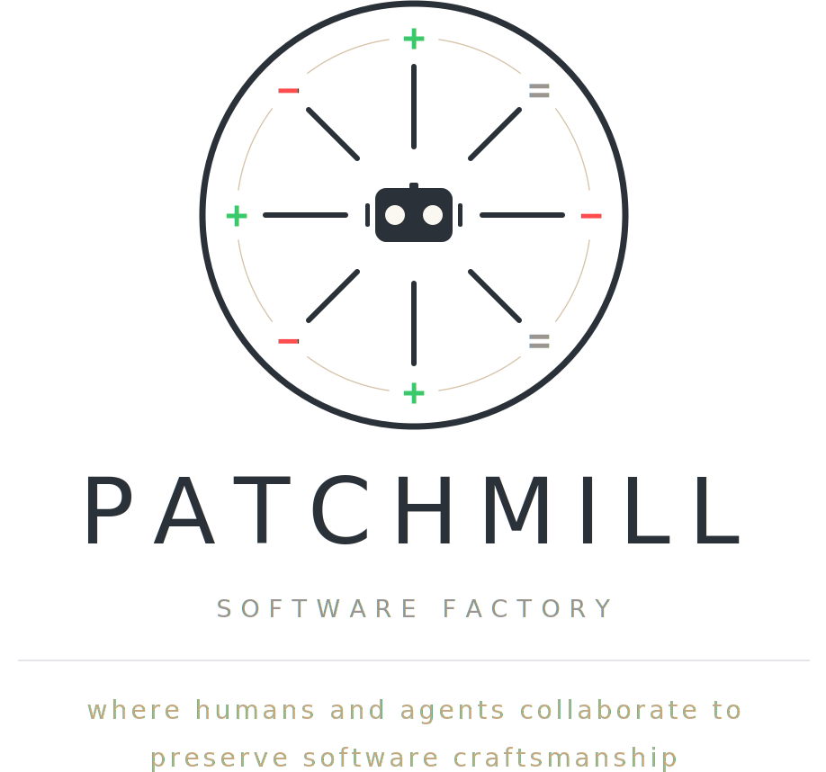

<p align="center">
  <picture>
    <source media="(prefers-color-scheme: dark)" srcset="docs/assets/logo-dark.svg">
    <source media="(prefers-color-scheme: light)" srcset="docs/assets/logo-light.svg">
    
  </picture>
</p>

Patchmill is an agent-driven software factory for turning product work into
reviewed, landed changes without hiding the engineering judgment between idea
and production.

It gives automated development an explicit production line: intake incoming
work, sort what is ready, write or reuse a plan, implement in an isolated
worktree, review the result, collect evidence when needed, land the change, and
record what happened. The goal is not a black box that writes code for you; it
is a factory floor where every station is visible, configurable, and designed to
preserve software craftsmanship while making iterative engineering scalable.

## What Patchmill does

Patchmill connects an issue host, repository policy, git worktrees, and
configurable workflow instructions so a repository can move from open product
work to reviewed diffs with clear handoffs.

The two main workflow stations are:

- `patchmill triage` is the intake/sorting station. It classifies open issues
  and can apply readiness labels or comments.
- `patchmill run-once` is the one-issue production run. It claims one ready
  issue, creates or reuses a plan, runs implementation, reviews or lands the
  result, and records the outcome.

Planned: `patchmill run` will start the factory loop. It will keep selecting the
next ready issue and running the same controlled production process until there
is no eligible work left, a configured issue/budget limit is reached, or a
blocker requires human input.

The controls stay close to the work: labels decide what is ready, dry runs show
what Patchmill would do before it mutates the issue host, plans make scope
reviewable, run logs preserve progress, and repository skills let teams encode
their own process.

`patchmill triage` executes the configured triage skill by default and reports
what changed. Use `patchmill triage --dry-run` to preview the labels, comments,
closures, canonical bucket, and rationale the skill would produce without
mutating the issue host.

Supported issue hosts are Forgejo/Gitea through `tea` (`forgejo-tea`) and GitHub
through `gh` (`github-gh`). GitHub visual-evidence upload is not supported in
the first `github-gh` version; Forgejo visual-evidence upload uses the
`PATCHMILL_FORGEJO_*` environment variables.

## First use

After installing Patchmill, start with the safety-first onboarding flow:

```sh
patchmill init
patchmill doctor
patchmill triage --dry-run
patchmill run-once --dry-run
patchmill run-once --execute
```

`patchmill init` writes a minimal local `patchmill.config.json` and reminds you
how to change the default host login. `patchmill doctor` is read-only: it checks
git, host access, labels, configured skills, runtime access, and local paths,
verifying bundled/path-like skills and flagging name-only skills as unverified
before recommending dry runs.

## Configuration

Patchmill loads `patchmill.config.json` from the repository root and fills
omitted fields with defaults. A functional starting point for the default
workflow looks like this:

```json
{
  "host": {
    "provider": "forgejo-tea",
    "login": "triage-agent"
  },
  "skills": {
    "triage": "patchmill-issue-triage",
    "planning": "superpowers:writing-plans",
    "implementation": "superpowers:subagent-driven-development"
  },
  "paths": {
    "plansDir": "docs/plans",
    "runStateDir": ".patchmill/runs",
    "triageLogDir": ".patchmill/triage-runs",
    "worktreeDir": ".worktrees"
  }
}
```

The default skills keep the workflow small and explicit:

- `patchmill-issue-triage` is the bundled default triage skill; normal triage
  runs it (or your configured replacement) and reports observed changes, while
  `--dry-run` uses a read-only preview JSON pass.
- `superpowers:writing-plans` writes implementation plans before code changes.
- `superpowers:subagent-driven-development` executes approved plans with
  worker/reviewer handoffs.

Accepted `host.provider` values are `forgejo-tea` for Forgejo/Gitea through
`tea` and `github-gh` for GitHub through `gh`.

Customize `skills` when your repository needs different procedures. Optional
skill hooks include `toolchain`, `review`, `visualEvidence`, and `landing`; see
[skills configuration](docs/skills.md) for details and
[configuration examples](docs/configuration.md) for a fuller
`patchmill.config.json`.

## Environment variables

Environment variables are best for machine-local identity, CI secrets, and host
upload credentials that should not live in `patchmill.config.json`.

- `PATCHMILL_HOST_LOGIN`: host account/login override for providers that support
  named logins, such as `forgejo-tea`; ignored by providers without named-login
  support, such as `github-gh`.
- `PATCHMILL_FORGEJO_URL`: Forgejo base URL used when uploading visual evidence
  to PRs.
- `PATCHMILL_FORGEJO_TOKEN`: Forgejo API token for visual-evidence uploads.
- `PATCHMILL_FORGEJO_REPO`: optional `owner/repo` override when Patchmill cannot
  infer the Forgejo repository from git remotes.

CLI flags override environment variables, and environment variables override
`patchmill.config.json`.

## Runtime and subagent customization

Patchmill uses Pi as the runtime harness for configurable agent work. Most users
start by configuring issue hosts, labels, paths, and skills; Pi becomes relevant
when you want to customize the runtime, delegated agent roles, models, tools, or
context behavior.

Patchmill includes `pi-subagents`; users do not install it separately.
Implementation prompts can rely on the Pi `subagent` tool and the agents
discovered by pi-subagents. The default implementation skill,
`superpowers:subagent-driven-development`, can use pi-subagents builtin agents
such as `worker`, `reviewer`, `scout`, `planner`, `context-builder`,
`researcher`, `delegate`, and `oracle`.

Agent files define reusable delegated roles and can live in:

- `~/.pi/agent/agents/**/*.md` for user-scope agents
- `.pi/agents/**/*.md` for project-scope agents

Settings overrides can live in `~/.pi/agent/settings.json` or
`.pi/settings.json`. For example:

```json
{
  "subagents": {
    "agentOverrides": {
      "reviewer": {
        "model": "anthropic/claude-sonnet-4",
        "thinking": "high"
      }
    }
  }
}
```

A minimal project agent file looks like:

```md
---
name: worker
description: Project-specific implementation worker
model: anthropic/claude-sonnet-4
thinking: high
tools: read, grep, find, ls, bash, edit, write
systemPromptMode: append
inheritProjectContext: true
inheritSkills: true
---

Follow this repository's implementation conventions. Escalate unclear product or
architecture decisions instead of guessing.
```

Customize agents with normal pi-subagents user or project configuration when
your repository needs different models, tools, context behavior, or nested
delegation. If you want a child agent to delegate further, include the
`subagent` tool in that agent's tools and configure nesting/depth through
pi-subagents settings. Patchmill does not override those user choices.

## State paths

Patchmill writes local run state under `.patchmill/`:

- `.patchmill/runs/`
- `.patchmill/triage-runs/`

These paths are local workflow state, not source documentation.

## Issue-agent workflows

For a deeper newcomer-friendly walkthrough,
[issue-agent workflows](docs/issue-agent-workflows.md) explains how the intake
station selects and labels issues, how `run-once` claims work, how planning and
implementation prompts are shaped, and where Patchmill records progress and
safety checkpoints.

## Reference docs

- [Configuration examples](docs/configuration.md)
- [Issue-agent workflows](docs/issue-agent-workflows.md)
- [Providers](docs/providers.md)
- [Skills configuration](docs/skills.md)
- [Task contracts](docs/task-contracts.md)
