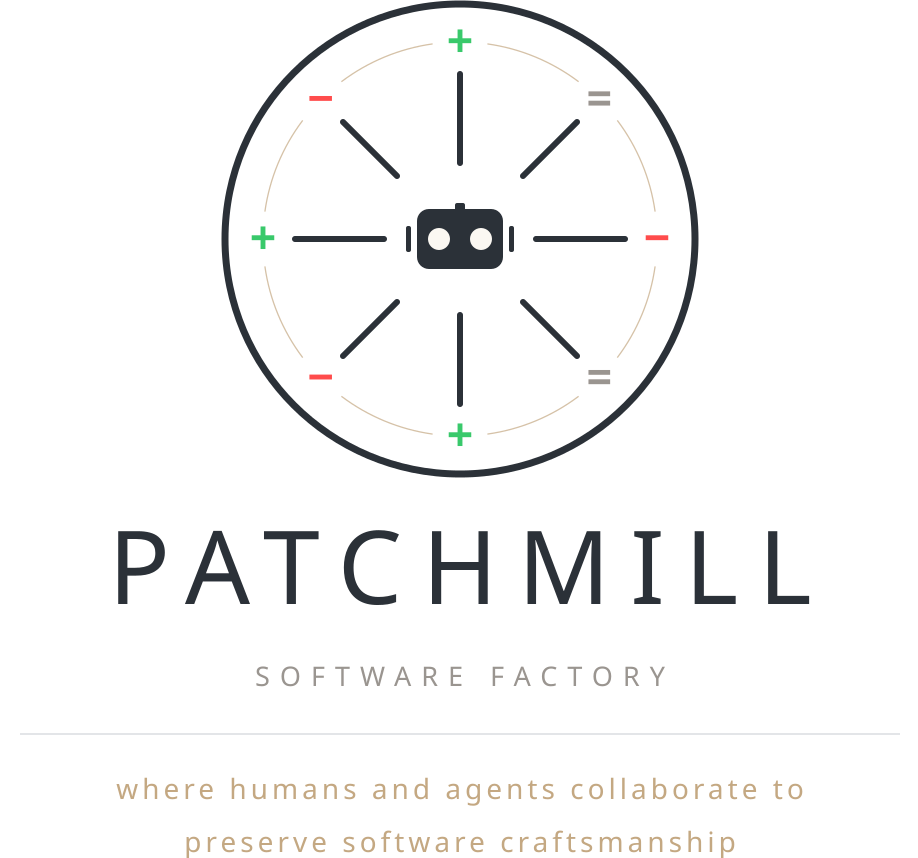

<p align="center">
  <picture>
    <source media="(prefers-color-scheme: dark)" srcset="docs/assets/logo-dark.svg">
    <source media="(prefers-color-scheme: light)" srcset="docs/assets/logo-light.svg">
    
  </picture>
</p>

Patchmill turns issues in your issue tracker into pull requests. It uses an AI
coding agent ([Pi](https://github.com/earendil-works/pi)) to read an issue,
write a design and a plan, write the code, and open a pull request. You review
and merge the pull request.

You can change how the agent does its work. Skills (Markdown instruction files
for the agent) define how it triages, plans, codes, reviews, and collects
evidence. Patchmill installs a default set of skills in your repository. You can
edit them, or point Patchmill at your own skills. The Patchmill program itself
only starts the agent, tracks the issue, and checks the result.

Patchmill runs on your computer, in a clone of your repository. It works with
GitHub through the `gh` CLI, and with Forgejo or Gitea through the `tea` CLI.

Read the full documentation at **[patchmill.dev](https://patchmill.dev)**.

## How Patchmill works

You decide which issues the agent can work on. Patchmill then moves each issue
through these steps:

1. Triage: the agent reads each open issue and decides if it suits automated
   work. Patchmill labels the issue `agent-ready`, `needs-info`, or
   `agent-unsuitable`, and adds a comment. You can also add `agent-ready`
   yourself.
2. Claim: `patchmill run-once` selects one ready issue whose dependencies are
   closed. It labels the issue `in-progress`.
3. Plan: the agent writes a spec (a design document) and an implementation plan.
4. Implement: the agent writes the code and tests in a git worktree (a separate
   checkout of your repository). Then it opens a pull request that closes the
   issue.
5. Hand off: Patchmill makes sure that the pull request exists, and labels the
   issue `agent-done`. You review and merge the pull request.

If the agent needs more information, it asks questions on the issue and labels
it `needs-info`.

By default, one pull request holds the spec, the plan, and the code. To approve
the spec or the plan before the agent writes code, turn on a planning gate. Each
gate opens a separate planning pull request. The run continues after you merge
that pull request.

Patchmill has two parts. A small kernel (the core program) starts Pi, claims
issues, decides the next step from git and the issue host, and checks the
result. Skills decide what the agent does in each step. To change the workflow,
change the skills, as [Skills](#skills) describes. The
[overview](https://patchmill.dev/getting-started/overview/) explains this split.

## Requirements

- A git repository with an `origin` remote on GitHub, Forgejo, or Gitea.
- The `gh` or `tea` CLI, logged in to that host.
- Node.js 22.19.0 or later.
- An account with a model provider that Pi supports, by subscription or API key.

## Quickstart

Run these commands in your repository. For Forgejo or Gitea, use
`--provider forgejo-tea`.

```sh
npm install -g patchmill
patchmill init --provider github-gh   # write configuration, install skills
patchmill auth                        # choose a model provider and a model
patchmill labels setup                # create the workflow labels
patchmill doctor                      # make sure that everything is ready
patchmill triage --dry-run            # preview the triage results
patchmill triage                      # label the open issues
patchmill run-once                    # take one ready issue to a pull request
```

`auth` asks for an authentication method, a provider, and a default model. It
saves them in the Pi agent directory of the repository. Then it sends a real
prompt to the provider and returns to your shell. `doctor` and
`triage --dry-run` also call the model, so they use tokens.

The [quickstart guide](https://patchmill.dev/getting-started/quickstart/) gives
more detail for each step.

## Run issues

`patchmill run-once` advances one issue, then exits. Run it again to take the
next issue.

```sh
patchmill run-once                  # select the next eligible issue
patchmill run-once --issue 42       # work on issue 42
patchmill run-once --dry-run        # show the issue and its next step only
patchmill run-once --plan-only      # stop after planning
```

A dry run does not claim the issue and does not start Pi. If a planning gate
waits for a merge, the issue stays `in-progress` and no Pi session runs. Merge
the planning pull request, then run `patchmill run-once --issue N` again. Review
approval alone does not unlock a gate.

With both gates on, merge the spec pull request, then the plan pull request.
Each later branch starts from the base branch with the merged documents.

The [Run-once guide](https://patchmill.dev/using-patchmill/run-once/) explains
gates, resume, and failures.

### Interactive issue runs

```sh
patchmill run-once --issue 225 --interactive
```

This command opens a Pi console. You plan the issue with the agent in the
console, and a background worker does the implementation. The workflow is the
same as for `run-once`. `--issue N` is optional. Without it, Patchmill selects
the next eligible issue. If no issue is eligible, the command exits without an
error. You cannot combine `--interactive` with `--dry-run` or `--plan-only`.

The console agent uses four tools:

- `patchmill_submit_planning_result`: submit a planning result after your
  review, in one dialog. If you request changes or press Escape, planning stays
  open.
- `patchmill_continue_issue_run`: check a merge that the run waits for, and
  continue the run.
- `patchmill_run_status`: show the current run, the worker, the wait, and the
  estimated cost.
- `patchmill_confirm_block_guidance`: send guidance to a blocked worker after
  you confirm it.

The planning dialog names the issue and the document. It shows the files, the
branch, and a short commit hash. It lists two to five key decisions, not the
full summary of the agent.

For a required gate, the dialog offers three choices:

- Approve and open a planning PR: the run waits for you to merge that pull
  request.
- Approve without a PR (continue now): Patchmill pushes the approved planning
  commit to the implementation branch and continues at once. Later documents
  stay on that branch.
- Request changes: planning stays open.

A later required gate offers only "Approve (continue now)" and "Request
changes". The dialog explains which earlier document prevents a planning pull
request. Without gates, the dialog asks if you reviewed the spec, the plan, or
both. It offers "Reviewed, continue" and "Request changes".

If you request changes or press Escape, Patchmill pushes nothing. After a
restart, Patchmill reads approvals from the pushed documents, not from saved
state.

To start another issue after the current run ends, type `/patchmill-issue <N>`.
Each issue has its own conversation under `<runsDir>/issue-<N>/console/`. When
you open an issue again, the console resumes its newest session.

After the implementation pull request merges, an interactive run removes the
worktrees and local branches of the issue. It keeps each worktree that has
uncommitted changes and shows the reason in the chat. Non-interactive runs leave
worktrees in place.

When you quit the console, the worker stops. At startup, Patchmill stops stray
workers before it starts a run. If it cannot stop them, it does not start the
run. Do not start this command inside a pi-subagents child process.
`PI_SUBAGENT_CHILD=1` disables pi-subagents.

## Sample web page

Run `patchmill serve` to open the view-only sample board and issue pages. It
needs no repository, config, or provider account. All fonts and page assets ship
locally. Chat and run controls show a note but change nothing.

The default address is `127.0.0.1:4280`. Open the printed secret-token link. The
server stores an HttpOnly cookie and removes the token from the address. Set
`PATCHMILL_SERVE_TOKEN` to keep a token across restarts. Otherwise, each start
creates a new random token. Keep the printed link private.

Use `--host HOST` and `--port PORT` to change the listener. A non-loopback
listener is for a trusted network or VPN only. HTTP does not encrypt its content
or token. This command serves sample data, not actual issues or runs.

### Browser regression checks

From a development checkout, use an installed Chrome or Chromium browser:

```sh
CHROMIUM=/path/to/chromium npm run test:web
```

CI runs this command and fails if no browser is available. It checks mobile
layout, message controls, keyboard access, and delayed gallery images. The
command does not change reference screenshots by default.

To refresh its reference screenshots, set `LAYOUT_SCREENSHOTS=1`. To save its
measurements, set `LAYOUT_EVIDENCE` to a local JSON path.

## Commands

| Command                                                                    | What it does                                                                                                                            |
| -------------------------------------------------------------------------- | --------------------------------------------------------------------------------------------------------------------------------------- |
| `patchmill init`                                                           | Write configuration if it is missing, install skills, and set up the Pi agent directory. Safe to run again.                             |
| `patchmill auth`                                                           | Choose a subscription or API key, a provider, and a default model. Save them, test the provider, and return to the shell.               |
| `patchmill doctor`                                                         | Read-only checks: host CLI logged in, labels exist, worktree directory ignored, skills present, Pi answers a test prompt.               |
| `patchmill labels setup`                                                   | Create missing labels.                                                                                                                  |
| `patchmill triage [--dry-run]`                                             | Run the triage skill for each candidate issue. A dry run prints the labels and comment instead of applying them.                        |
| `patchmill run-once [--issue N] [--dry-run] [--plan-only] [--interactive]` | Advance one issue. A dry run prints the selected issue and its next step without a claim and without Pi.                                |
| `patchmill release --issue N`                                              | Clear a stale claim after a hard crash.                                                                                                 |
| `patchmill status [--all] [--issue N]`                                     | Show workflow status in local state mode. Read blockers of ready and in-progress issues live from the tracker.                          |
| `patchmill skills update`                                                  | Update the managed skill pack to the installed Patchmill version. Refuses edited managed files and removes files that the pack dropped. |
| `patchmill serve [--host HOST] [--port PORT]`                              | Serve the view-only sample board and issue pages.                                                                                       |
| `patchmill version`                                                        | Print the version.                                                                                                                      |
| `patchmill setup-test-repo`                                                | Development tool for the end-to-end CI. It is not part of the kernel.                                                                   |

## Labels and dependencies

| Label              | Meaning                                               | Set by                    | Removed by              |
| ------------------ | ----------------------------------------------------- | ------------------------- | ----------------------- |
| `agent-ready`      | Suitable for automation. Dependencies must be closed. | Human or triage           | Kernel on claim         |
| `in-progress`      | Work is active, or waits for a planning PR merge.     | Kernel on claim           | Kernel on final release |
| `needs-info`       | The agent asked questions, or the run attempt failed. | Kernel                    | Kernel on next claim    |
| `agent-done`       | A ready pull request that closes the issue exists.    | Kernel after verification | Human                   |
| `agent-unsuitable` | The issue is not suitable for unattended agent work.  | Triage                    | Human                   |

`agent-done` means that the pull request exists. It does not mean that the pull
request merged.

Native issue links control when work can start: **Blocked by** on GitHub and
**Depends on** on Forgejo and Gitea. Triage adds missing links. Patchmill skips
an issue while a dependency is open or unreadable. When the last dependency
closes, the issue becomes eligible on the next selection. The agents own git and
the pull request. Only the kernel changes labels and posts run comments.

If you used `blocked` labels in an earlier version, update those issues by hand.
The [triage guide](https://patchmill.dev/using-patchmill/triage/#manual-upgrade)
gives the steps. See
[Workflow labels](https://patchmill.dev/reference/workflow-labels/) for more
detail.

## Configuration

Patchmill reads `patchmill.config.json` in the repository root. `patchmill init`
creates it if it is missing. The example shows every key with its default value.
Each key is optional. Patchmill rejects unknown keys by name.

```json
{
  "host": { "provider": "github-gh", "login": "", "trustedAuthors": [] },
  "labels": {
    "ready": "agent-ready",
    "inProgress": "in-progress",
    "needsInfo": "needs-info",
    "done": "agent-done",
    "unsuitable": "agent-unsuitable"
  },
  "paths": {
    "specsDir": "docs/specs",
    "plansDir": "docs/plans",
    "worktreeDir": ".worktrees",
    "runsDir": ".patchmill/runs"
  },
  "git": { "baseBranch": null },
  "skills": {
    "triage": ".patchmill/skills/patchmill-issue-triage",
    "planning": ".patchmill/skills/patchmill-planning",
    "implementation": ".patchmill/skills/patchmill-implementation"
  },
  "pi": { "agentDir": ".patchmill/pi-agent", "timeoutMinutes": 90 },
  "workflow": {
    "stateTracking": "labels",
    "specApproval": { "required": false },
    "planApproval": { "required": false }
  }
}
```

These keys change the most:

- `workflow.specApproval.required` and `workflow.planApproval.required` turn on
  the planning gates.
- `workflow.stateTracking` selects labels on the host or
  [local state](#local-state-mode).
- `pi.timeoutMinutes` limits each Pi session.
- `git.baseBranch: null` uses the default branch of the remote.

The label names must be different from each other. The comparison ignores case.
`init` does not change a valid configuration, and rejects an invalid one. The
[configuration guide](https://patchmill.dev/getting-started/configuration/)
explains each key, including host logins and trusted comment authors.

## Local state mode

Set `workflow.stateTracking` to `"local"` to keep the workflow state on this
computer. The default is `"labels"`.

In local mode, Patchmill keeps issue copies and status history in
`.patchmill/state/`. It does not use labels or status comments. It still posts
questions, opens pull requests, adds cost reports to pull request bodies, and
adds dependency links. Questions are the only issue comments that it posts.

`patchmill status` reads the local state without a sync, and shows the time of
the last sync. It reads the blockers of ready and in-progress issues live from
the tracker. A blocker in the same repository shows its local status, for
example `(Ready)` or `(In Progress)`. A done blocker shows
`(Done, PR not merged)`. An open pull request marks work done, but the issue
blocks other issues until it closes after the merge. Other blockers show no
status note. Add `--all` to include closed issues. Add `--issue N` to see the
full status history of one issue and, if it is open, its live blockers.

`patchmill labels setup` refuses to run in local mode. `patchmill doctor` checks
the state folder instead of the labels.

Local state mode is for one user on one computer. When you change modes,
Patchmill does not move the state.

## Safety

- Each phase runs in a new Pi session. Patchmill stops a session after
  `pi.timeoutMinutes` (90 minutes by default).
- A lock file stops two runs in the same clone from working on one issue.
  Separate clones can still race. Do not delete the lock file or its folder,
  even after a crash. To clear a stale claim, run `patchmill release --issue N`.
- Patchmill decides the next step from git and the issue host only. Logs, result
  files, and labels never decide it.
- Names are stable. Implementation branches are `agent/issue-N-<slug>`. Specs
  are `docs/specs/YYYY-MM-DD-issue-N-<slug>-design.md`. Plans are
  `docs/plans/YYYY-MM-DD-issue-N-<slug>-plan.md`. If a plan from an earlier
  version has no `-plan` suffix, rename it once.
- The skills tell the agent not to push to the base branch and not to force
  push. Shell access cannot enforce this. Use branch protection on your host to
  block direct pushes.

The [Run-once guide](https://patchmill.dev/using-patchmill/run-once/) and
[Git safety](https://patchmill.dev/reference/git-safety/) give the full rules.

## Skills

`patchmill init` installs the Patchmill skills in `.patchmill/skills`, together
with pinned [Superpowers](https://github.com/obra/superpowers) and SimpleEnglish
skills. Three keys in `patchmill.config.json` select the skill for each step:
`skills.triage`, `skills.planning`, and `skills.implementation`. Each key names
a directory that contains a `SKILL.md` file.

To change the workflow, copy a skill to a new directory, edit the copy, and set
the matching key to that directory. Your skill must keep the result format that
the kernel reads, and must leave labels and issue comments to the kernel. Put
project rules, such as setup and test commands, in skills or `AGENTS.md`.

Run `patchmill skills update` after you upgrade Patchmill. The command refuses
to overwrite managed skill files that you edited.

For visible browser changes, planning adds an offline HTML mockup of the full
page to the spec. After validation, implementation reviews the frontend against
pinned local rules, fixes each valid finding, and records the review in the pull
request. Backend work, documentation, and small text changes skip both steps.
See [Skills configuration](https://patchmill.dev/guides/skills-configuration/).

## Roadmap

The [roadmap](docs/roadmap.md) describes future work, not current features.

## License

Apache-2.0. See [LICENSE](LICENSE).
